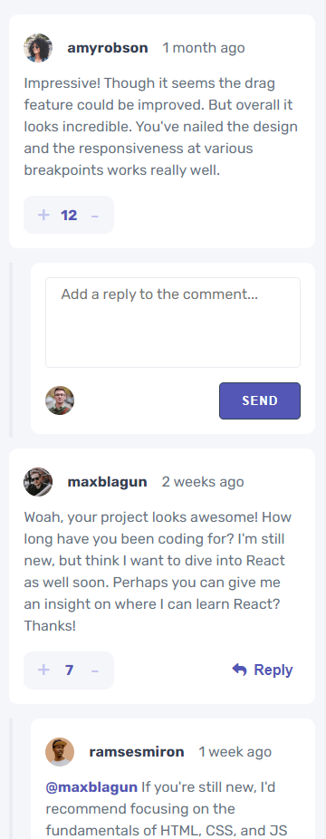
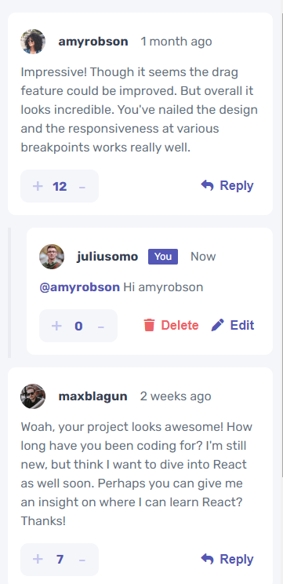
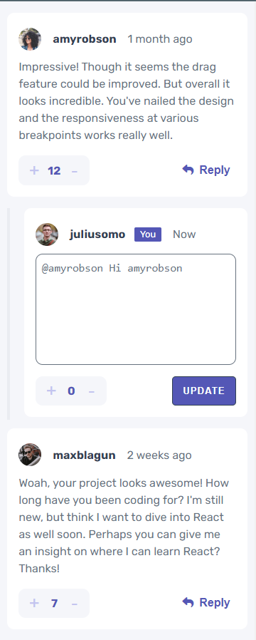

# Frontend Mentor - Interactive comments section solution

This is a solution to the [Interactive comments section challenge on Frontend Mentor](https://www.frontendmentor.io/challenges/interactive-comments-section-iG1RugEG9). Frontend Mentor challenges help you improve your coding skills by building realistic projects. 

## Table of contents

- [Frontend Mentor - Interactive comments section solution](#frontend-mentor---interactive-comments-section-solution)
  - [Table of contents](#table-of-contents)
  - [Overview](#overview)
    - [The challenge](#the-challenge)
    - [Screenshots](#screenshots)
    - [Links](#links)
  - [My process](#my-process)
    - [Built with](#built-with)
    - [What I learned](#what-i-learned)
  - [Author](#author)

## Overview

### The challenge

Users should be able to:

- View the optimal layout for the app depending on their device's screen size
- See hover states for all interactive elements on the page
- Create, Read, Update, and Delete comments and replies
- Upvote and downvote comments
- **Bonus**: If you're building a purely front-end project, use `localStorage` to save the current state in the browser that persists when the browser is refreshed.
- **Bonus**: Instead of using the `createdAt` strings from the `data.json` file, try using timestamps and dynamically track the time since the comment or reply was posted.

### Screenshots

 

### Links

- Solution URL: [Add solution URL here](https://github.com/hernanruscica/Frontend_mentor_Interactive-comments-section)
- Live Site URL: [Add live site URL here](https://hernanruscica.github.io/Frontend_mentor_Interactive-comments-section)

## My process

I started with the styles of the modules, with a "mobile First" workflow. I made a static page where the design would look like the requirements.
In order to complete the 'comment module' requirements, I had to use 'css grid'.
Once the styles were finished, I continued with the functionalities in JavaScript. I Took the suggestions of the Bonuses of the challenge and I used the storage in the browser with the localStorage.
The application workflow starts by checking if there is a 'data' variable in the browser, that variable contains the parsed JSON file.
If it doesn't exist, it loads the data from the JSON file ONCE, then works with the data from localStorage.
Note: I rearranged the comments and answers in the 'data' variable, to make it more clear for me.
The first thing I did is load all the comments on the page. Initially the page has only one container for the different comment and answer modules.
Each comment or answer is formed with a "data attribute" that indicates its id in the 'data' variable. The buttons have an 'id' that indicates what type of action it performs, and with the 'dataset.id' I know on which comment that action is performed.
Through event delegation, I recognize what type of action and comment and/or response each button affects.
I also made the functions to update, delete and enter comments to the variable.

### Built with

- Semantic HTML5 markup
- CSS custom properties
- Flexbox
- CSS Grid
- Mobile-first workflow
- Vanilla JavaScript
- Document Object Model
- LocalStorage 

### What I learned

This is one of the most complete frontend applications I have made with VANILLA JAVASCRIPT, it was challenging. It also includes a part of backend code, which although it is small, generates the idea of ​​being a more complex application.

## Author

- Website - [ruscica-code.ar](https://ruscica-code.ar)
- Frontend Mentor - [@hernanruscica](https://www.frontendmentor.io/profile/hernanruscica)
- GitHub - [github.com/hernanruscica](https://github.com/hernanruscica)

